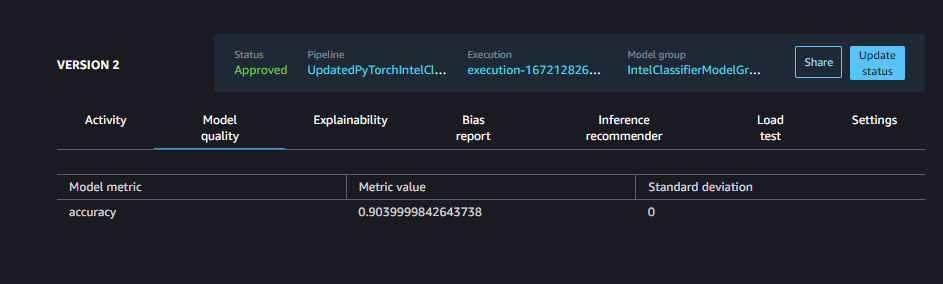

# TSAI-Assignment13-CI_CD_Pipeline
The main objective of this assignment is to run CI/CD pipeline.

# Pipeline

# Model
After training, model status is updated manually.

Model evaluation found [here](evaluation.json)

# Predictions
Predictions was performed on images of different classes which is found in [`05-test-staging.ipynb`](05-test-staging.ipynb).

# Code commit repo
Whenever the commit is done in model build repo, it trigger the pipeline and the CI/CD pipeline goes under execution.
